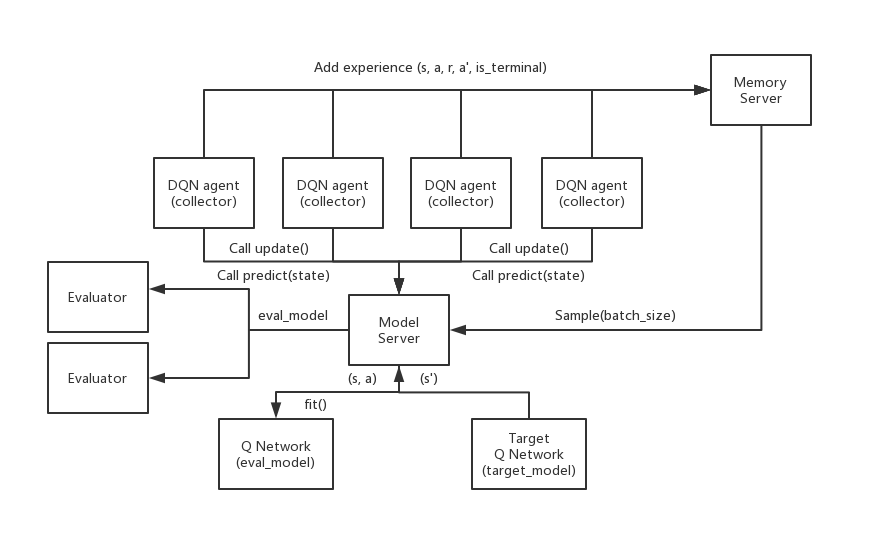

# Distributed Multi-Agent RL

This repository contains two independent reinforcement-learning code paths. They do not share an entry point, a dependency manifest, or a runtime.

| Code path | What it is | Entry point | Dependencies |
| --- | --- | --- | --- |
| **Distributed DQN** ([`framework/distributed_dqn/`](framework/distributed_dqn/README.md)) | DQN on a deliberately slowed CartPole. Experience collectors and evaluators run as Ray tasks, and a model-server actor and a replay-memory actor sit between them. | `distributed_dqn.py`, run from inside `framework/distributed_dqn/` | [`framework/distributed_dqn/requirements.txt`](framework/distributed_dqn/requirements.txt) (unpinned) |
| **PPO** ([`framework/ppo/`](framework/ppo/)) | Single-process, single-environment PPO on Gymnasium/ALE. It is **not** distributed and does not use Ray. | [`main.py`](main.py), run from the repository root | [`requirements.txt`](requirements.txt) (pinned environment snapshot) |

The DQN code began as an Oregon State University course project (CS533). The archived notebook links to the course materials, and the [project page](https://kapshaul.github.io/projects/distributed-agents/) describes the project in more detail.



*Distributed DQN architecture. See the [DQN README](framework/distributed_dqn/README.md) for how the script implements each component.*

## Distributed DQN

The full documentation is in [framework/distributed_dqn/README.md](framework/distributed_dqn/README.md). It covers the architecture, the DQN target, the role of each file, the default settings, how the archived notebook differs from the script, and known blockers. In short, `distributed_dqn.py` is a **prototype entry point**, not a verified reproduction path. As written, the script:

- uses Ray keyword arguments that newer Ray releases no longer accept;
- reads an undefined module-level variable when its first episode ends;
- imports `IPython`, which its requirements file does not list.

This repository does not store any learning curves or timing results from the script.

## PPO

### How `main.py` runs

`main.py` has no command-line options. It always calls `main(algorithm="PPO")`, which reads `./framework/ppo/config.ini` through a path relative to the current directory. Run it from the repository root. From anywhere else, `configparser` silently reads nothing and the first config lookup raises `KeyError`.

```bash
python main.py
```

Importing `framework` imports the PPO trainer, which imports `ale_py` and `gymnasium` at module load. Both must be installed even if you switch to a classic-control environment.

### Default configuration ([`framework/ppo/config.ini`](framework/ppo/config.ini))

| Setting | Value | Notes |
| --- | --- | --- |
| `env_id` | `ALE/Pong-v5` | Grayscale observations, resized to 84×84 and stacked 4 frames deep. The environment's own frame skip is kept (the override is commented out). |
| `max_train_steps` / `num_iterations` | 20,000,000 / 1 | A single `train()` call covering 20M environment steps |
| `batch_size` | 4096 | Rollout length per PPO update. The minibatch size is fixed at 1024 in code. |
| `ppo_epochs`, `ppo_clip_eps` | 3, 0.15 | |
| `gamma`, `lambda` | 0.99, 0.95 | GAE |
| `value_coef`, `entropy_coef` | 0.9, 0.05 | |
| `learning_rate`, `hidden_size` | 3e-4, 1024 | Adam |
| `max_episode_steps` | 100,000 | Manual episode cap inside the training loop |
| `evaluation`, `render` | 0, 0 | Evaluation after training is off by default |
| `seed` | 42 | Seeds PyTorch and NumPy only. `env.reset()` is called without a seed. |

Environments listed in `common/env_registry.py` use the CNN network in `framework/ppo/model/model.py`. This network has three convolution layers followed by two branches: a masked or scaled linear projection, and multi-head self-attention over the 7×7 spatial grid. The two branches are concatenated before the policy and value heads. All other environments use a two-layer MLP.

### Requirements for a full default run

- **Atari support.** `ale-py` must be importable and able to load the Pong ROM.
- **Time and hardware.** 20M Pong steps on one environment is a long job. CUDA is used automatically when available.
- **An existing `model/` directory at the repository root.** At the end of training, the trainer calls `torch.save(..., 'model/model.pt')` but never creates `model/`. The `framework/ppo/model/` package is a different directory. Without `model/`, the save fails after all training has finished, and the reward plot is never produced. Create the directory before starting (`mkdir model`).
- **A display, or a non-interactive Matplotlib backend.** The plot is saved and then passed to `plt.show()`.

### Outputs

| Path (relative to the working directory) | Written by |
| --- | --- |
| `results/log/reward_<timestamp>.log` | One line per finished episode: episode, reward, total steps. The trainer creates this directory. |
| `model/model.pt` | Final policy/value network `state_dict` (requires `model/` to exist) |
| `results/results.png` | Per-episode training reward with a 200-episode rolling mean |

`.gitignore` excludes `*.log`, `*.png`, and `*.pt`, so these files are not tracked.

### Implementation limitations

- **Gymnasium's `truncated` flag is ignored.** Episodes reset only on `terminated` or at the manual `max_episode_steps` cap. The GAE masks use `terminated` alone.
- **Evaluation is not deterministic.** When enabled, `test()` samples actions from the policy and does not switch the network to eval mode, so dropout in the CNN stays active.
- **Evaluation results are not plotted.** `ppo()` calls `plot_curves_train`, which plots training rewards only. Evaluation averages go into `test_reward_log`, and the `plot_curves` helper that could plot them is never called.

No PPO training logs, checkpoints, or result figures are included in the repository.

## Dependency manifests

- **[`requirements.txt`](requirements.txt)** (root, PPO): a `pip freeze`-style snapshot saved as **UTF-16** with a byte-order mark. It pins `torch==2.7.1+cu128`, `torchvision==0.22.1+cu128`, and `torchaudio==2.7.1+cu128`, which are only available from PyTorch's CUDA 12.8 wheel index, together with `gymnasium==1.2.0`, `ale-py==0.11.1`, `numpy==2.2.6`, and `pandas==2.3.1`. It does not include Ray. Before relying on it, make sure your tooling decodes UTF-16 and that the CUDA wheels match your platform.
- **[`framework/distributed_dqn/requirements.txt`](framework/distributed_dqn/requirements.txt)** (DQN): unpinned `gym[Box2D]`, `torch`, `JSAnimation`, `matplotlib`, `ray`, `tqdm`, `numpy`. See the DQN README for the gaps.

## Repository layout

```
main.py                         PPO entry point (hard-coded to PPO)
common/env_registry.py          Set of image-observation environment IDs
framework/__init__.py           Exposes ppo()
framework/ppo/
  config.ini                    PPO configuration
  ppo.py                        Reads config, seeds, runs training/evaluation/plot
  train_evaluate.py             PPOTrainer: env construction, rollout loop, save, test
  agent.py                      PPOAgent: clipped-surrogate update
  model/model.py, custom.py     MLP and CNN+attention actor-critic, custom masked layers
  utils/memory.py               Rollout buffer and GAE
  utils/plot.py                 Reward plots
  utils/preprocess.py           Frame-skip wrapper (not used by the trainer)
  utils/optimizer_tools.py      Per-layer learning-rate helper (call is commented out)
framework/distributed_dqn/      Ray-based DQN prototype (see its README)
```
